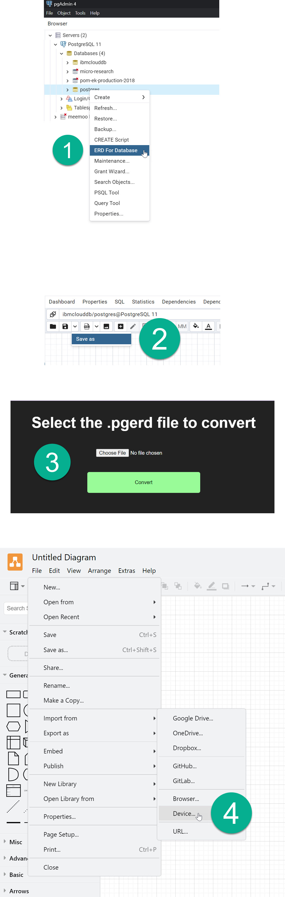

# pgerd-to-drawio-diagram-converter


Try it out on: https://bertyhell.github.io/pgerd-to-drawio-diagram-converter



## Programmatic interface

Installation:

```shell
npm install pgerd-to-drawio-diagram-converter
```


Use inside node:

```javascript
import {convertPgerdToDrawIo} from 'pgerd-to-drawio-diagram-converter';
import * as fs from "fs";

// Read the pgerd file as a string
const pgerdJsonString = fs.readFileSync('./diagram.pgerd').toString('utf-8');

// Interpret the string as json
const pgerdJson = JSON.parse(pgerdJsonString);

// Convert the json diagram info to a draw io xml format
const drawIoXmlString = convertPgerdToDrawIo(pgerdJson);

// Write the xml string to an xml file
fs.writeFileSync('./diagram.drawio.xml', drawIoXmlString);
```


Use inside a browser:

```javascript
import { saveAs } from 'file-saver';

const pgerdDiagramJson: PgErdDiagramInfo = JSON.parse(pgerdJsonString);
const drawIoXml = convertPgerdToDrawIo(pgerdDiagramJson);

const blob = new Blob([drawIoXml], { type: 'text/xml;charset=utf-8' });
saveAs(blob, 'diagram.drawio.xml');
```


React example:

[App.tsx](demo/src/App.tsx)
